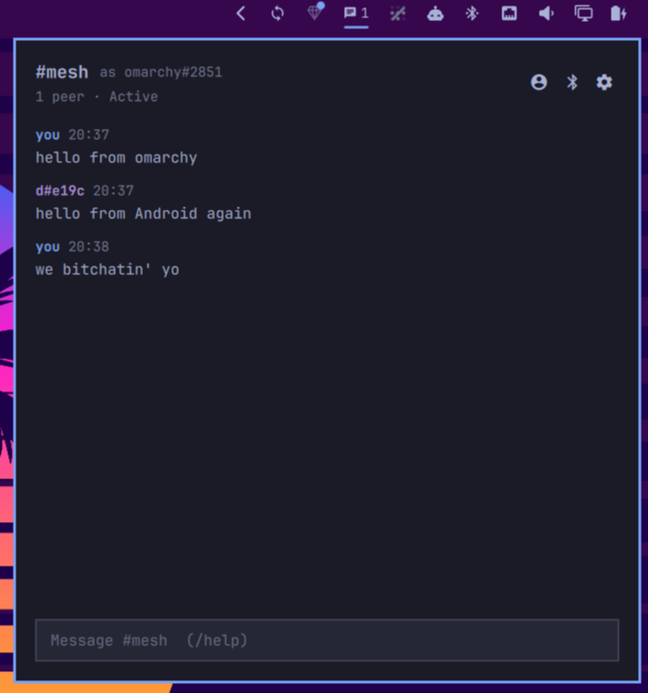

# Omarchy Bitchat



[bitchat](https://github.com/permissionlesstech/bitchat) mesh chat in the [Omarchy](https://omarchy.org) bar. Your laptop joins the same Bluetooth mesh as the bitchat apps on Android and iOS: it finds phones nearby, relays their traffic, and lets you talk in `#mesh` without internet, accounts or servers.

- **On the bar:** a chat glyph with the number of peers in range. It lights up when there's something unread. Left click opens the panel, right click opens it ready to type, middle click turns the mesh on or off.
- **In the panel:** `#mesh`, the public channel everyone in Bluetooth range shares. Messages are signed and checked. Mentions of `@yourname` are highlighted. The input line takes `/nick`, `/who`, `/clear` and `/help`, and Up recalls what you sent.
- **A real mesh node.** It relays other people's packets, including private messages and files it can't read, so the laptop extends the mesh. When a phone shows up, it backfills the messages each side missed (gossip sync).
- **Easy on the radio.** Scanning runs in bursts (8 s of every 10 on AC power; 2 s of every 30 on battery or while Bluetooth headphones are playing), so it doesn't stutter your audio. Phones can always connect to the laptop. Off turns everything off.
- **Notifications** when someone mentions you (or for everything, or never), but not while the panel is open.

Private messages, location (geohash) channels over Nostr and favorites are next; see [Roadmap](#roadmap).

## Keys

| Key | Does |
| --- | --- |
| `Enter` | Send |
| `Up` / `Down` | Recall what you sent |
| `PgUp` / `PgDn` | Scroll the chat |
| `Esc` | Clear the line, then close |
| `Tab` | Next bar panel |

| Command | Does |
| --- | --- |
| `/nick <name>` | Change your nickname (up to 15 characters) |
| `/who` | Show the peers in range |
| `/clear` | Clear the chat history |
| `//text` | Send a line that starts with `/` |

## Requirements

- Omarchy 4 or newer (the Quickshell `omarchy-shell`)
- A Bluetooth adapter that supports LE peripheral mode, which most from the last ten years do. `bluetoothctl show` should list `Roles: peripheral`.
- BlueZ with its default settings (Omarchy ships 5.87). No configuration changes and no root.
- Rust to build the daemon: the `rustup` package, then `rustup default stable`

## Install

```bash
omarchy plugin add https://github.com/derekross/omarchy-bitchat
~/.config/omarchy/plugins/derekross.bitchat/dist/install.sh
omarchy plugin enable derekross.bitchat --section right
```

`install.sh` builds `bitchatd` (the daemon) and `bitchatctl` (a command-line client) and puts them in `~/.local/bin`. It also installs the `bitchat.service` user unit (and starts it on first install) and links the plugin in place. No sudo or pkexec is required; nothing is downloaded except the crates cargo fetches while building.

The scripts only ever replace or remove a file whose SHA-256 matches what they installed: the record lives in `~/.local/state/omarchy-bitchat/installed.tsv`, and earlier versions of the unit are listed in `dist/known-hashes.tsv`. Anything else at those paths is yours. They refuse it and tell you so, and won't follow symlinks. To replace one of your files there, pass `--replace-existing=<path>`; it is moved to `~/.local/state/omarchy-bitchat/backup/`, and no script ever deletes that folder. The service is stopped, restarted or disabled only when systemd confirms it is this unit running this binary.

From a checkout instead: `git clone … && cd omarchy-bitchat && ./dist/install.sh`, which also links the checkout into `~/.config/omarchy/plugins`.

## Settings

| Setting | Default | |
| --- | --- | --- |
| `notify` | `mentions` | `mentions`, `all` or `off` |
| `showPeerCount` | `true` | Peer count next to the glyph |
| `persistHistory` | `true` | Keep the last 500 messages across restarts. Off deletes them. |
| `clock24h` | `true` | 24-hour message times |

The radio mode (Auto, Active, Saver, Off) and your nickname live in the panel's settings and are kept by the daemon.

## From the terminal

```bash
bitchatctl status          # radio, identity, peers
bitchatctl peers
bitchatctl send hello mesh
bitchatctl tail            # follow the chat
bitchatctl mode saver      # auto | balanced | saver | off
bitchatctl forget <id>     # forget a peer's pinned key (it reset its keys)
omarchy-shell derekross.bitchat toggle   # for a keybinding
```

## Update

```bash
omarchy plugin update derekross.bitchat
~/.config/omarchy/plugins/derekross.bitchat/dist/install.sh
```

## Remove

```bash
~/.config/omarchy/plugins/derekross.bitchat/dist/uninstall.sh      # --purge also deletes your identity, history and settings (never backups)
omarchy plugin remove derekross.bitchat
```

## Privacy and security

**What leaves the machine:** only Bluetooth LE traffic to devices in range. There is no internet traffic, telemetry or account. No sudo or pkexec is required.

- **Public is public.** `#mesh` messages are signed but not encrypted, like on the phone apps. Anyone in range running bitchat can read them, and so can anyone listening to Bluetooth.
- **Your identity** is a pair of keys made on first run: Curve25519 for Noise and Ed25519 for signing. They're in `~/.local/share/omarchy-bitchat/identity.json` (mode 0600) and never leave the machine. Your peer ID is derived from the Noise key. `uninstall.sh --purge` deletes it, so you start over as someone new.
- **What nearby devices can see.** While the mesh is on, your laptop advertises a bitchat service (only the service UUID, no name). It does so from your adapter's address, which on most laptops is fixed, so the laptop can be recognised over time. Anyone who connects can also read the adapter's Bluetooth name (`bluetoothctl show`, "Alias"). To blur both, set `Privacy = device` in `/etc/bluetooth/main.conf` and give the adapter a neutral alias. Off stops all advertising, scanning and connections.
- **Only what verifies.** Messages and announces whose signature doesn't check out are dropped and never relayed.
- **Trust on first use.** The protocol doesn't prove that a peer owns the Noise key it announces, so a peer ID could be claimed by a stranger who got there first. The daemon remembers the signing key each peer ID first used over a direct link and refuses a different one later, even after a restart. These keys are kept in `~/.local/state/omarchy-bitchat/peers.json`, up to 5,000 peer IDs, whether or not history is kept; `--purge` deletes the file. If someone you know reset their app's keys, `bitchatctl forget <peer-id>` accepts their new one. Names show `#` plus 4 hex digits of the peer ID, or 8 when two peers share a nickname, because 4 digits are easy to match deliberately. Treat names on a public mesh as claims, not proof.
- **Bounded against floods.** Everything a stranger in range can make the daemon hold is capped: message and packet sizes (as the iOS app caps them), peers, fragments per link, queued replies and history on disk. The service is also limited to 256 MB of memory. Files larger than about 1 MiB, which only Android-to-Android transfers produce, aren't carried through this node.
- **Text from strangers is shown as text.** The panel renders it as plain text, notifications escape markup and are rate-limited, `bitchatctl` escapes terminal control characters, and invisible bidi and zero-width characters are stripped.
- **History** of `#mesh` (the last 500 messages, including strangers') is kept in `~/.local/state/omarchy-bitchat/messages.jsonl` (mode 0600). Turn off "Keep chat history" to stop saving and delete it.
- **The control socket** (`$XDG_RUNTIME_DIR/bitchat/bitchat.sock`) accepts only your own user. Any program running as you can therefore post to `#mesh` through it. That's no more than such a program could already do, since it can also read your identity file.
- **The daemon runs sandboxed** (see `dist/bitchat.service`):
  - Your home is an empty tmpfs, with only the binary and its two state folders mapped in.
  - It can't reach your session bus or systemd user manager.
  - It can open only Unix sockets; Bluetooth goes through BlueZ over the system D-Bus.
  - It has no devices and is limited in memory and tasks.
  - It never dumps core.

## How it works

```
phones ⇄ BLE ⇄ BlueZ ⇄ D-Bus ⇄ bitchatd ⇄ bitchat/bitchat.sock (JSON lines) ⇄ Service.qml ⇄ bar + panel
```

- `crates/bitchat-proto` implements the bitchat wire protocol, byte-compatible with [bitchat-android](https://github.com/permissionlesstech/bitchat-android) and [bitchat for iOS](https://github.com/permissionlesstech/bitchat): packets v1 and v2, padding, raw-deflate compression, Ed25519 signing, fragmentation, announces, dedup, relay policy and GCS gossip sync. It's pure and unit-tested.
- `crates/bitchatd` uses [bluer](https://github.com/bluez/bluer) to be both a GATT peripheral (advertises service `F47B5E2D-…-4B5C`, hosts the characteristic) and a GATT central (scans, connects, writes, subscribes), like the phone apps. A pure mesh engine (`mesh.rs`) makes every protocol decision. It survives BlueZ restarts and the adapter being switched off and on, and it sends a LEAVE when it stops.
- The QML side follows the other Omarchy plugins: one `Service.qml` connection shared by every monitor's bar widget, and a `KeyboardPanel` popup styled from the theme.

Logs: `journalctl --user -u bitchat.service`. For more detail, set `BITCHAT_LOG=bitchatd=debug` in the unit.

## Roadmap

1. **Private messages:** Noise XX sessions with delivery and read receipts, and a DM view in the panel.
2. **Location channels:** geohash channels over Nostr (kind 20000), ported from [BitchatX](https://github.com/derekross/bitchatx).
3. **Nostr fallback for DMs** to mutual favorites (NIP-17).

## Development

```bash
cargo test --workspace          # protocol, mesh engine, store, power
node --test tests/              # Model.js
omarchy plugin validate .
BITCHAT_LOG=bitchatd=debug cargo run -p bitchatd   # stop bitchat.service first
```

## License

MIT
